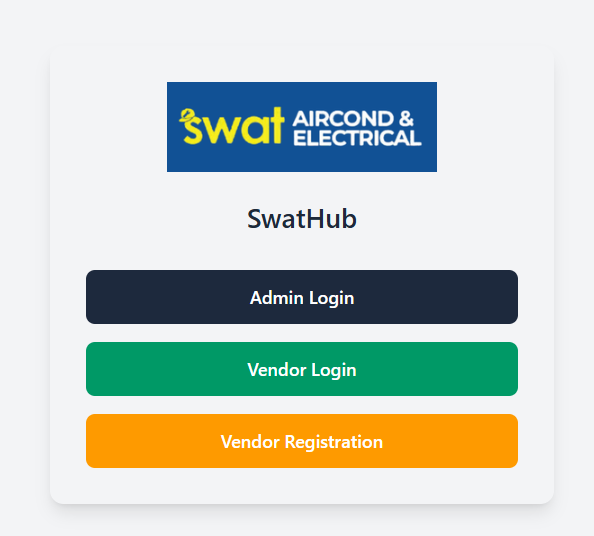
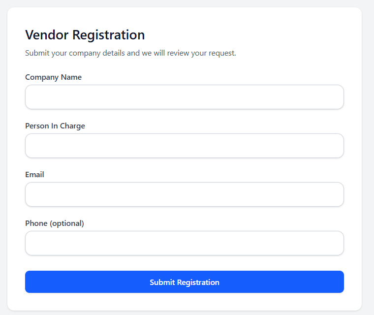
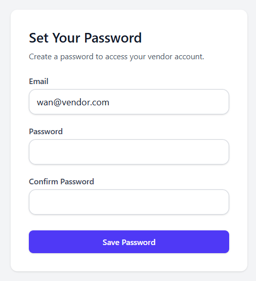
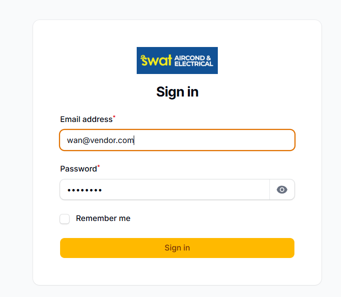

# SwatHub – Vendor Registration Guide

This guide explains how to register as a vendor on **SwatHub** and access your vendor dashboard.

## Step 1: Open SwatHub Portal

Go to the SwatHub staging portal using the link below:

https://staging.swataircond.com.my/

You will see the main login page with three options:
- Admin Login
- Vendor Login
- Vendor Registration

## Step 2: Click **Vendor Registration**

Click the **Vendor Registration** button to start your application.

## Step 3: Fill in Vendor Registration Details

Please complete the vendor registration form with the following information:

- **Company Name**
- **Person In Charge**
- **Email Address**
- **Phone Number** (optional)

Once completed, click **Submit Registration**.

> Your registration will be reviewed by the system administrator.
> You will not be able to log in until your account is approved.

## Step 4: Wait for Approval & Password Setup Email

After your registration is approved, you will receive a link containing a **password setup link**.

Example password setup link format (dummy example):

https://staging.swataircond.com.my/password/reset/xxxxxxxxxx?email=user%nnvendor.com

> Note: The actual link and token will be unique and sent to your registered email.

Click the link provided in the email.

## Step 5: Set Your Password

On the **Set Your Password** page:

1. Confirm your email address
2. Enter your new password
3. Confirm your password
4. Click **Save Password**

Your vendor account will now be activated.

## Step 6: Sign In as Vendor

Return to the SwatHub portal:

https://staging.swataircond.com.my/

1. Click **Vendor Login**
2. Enter your email and password
3. Click **Sign In**

You can now access the **Vendor Dashboard** and start using SwatHub.

## Need Help?

If you do not receive the password setup link, please contact the system administrator or SwatHub support team.

